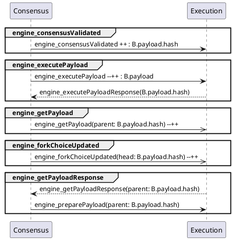
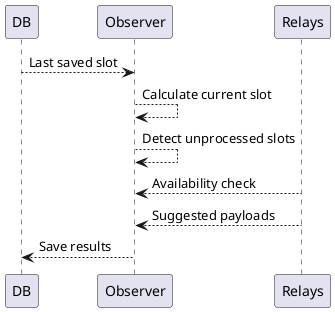

::: note

Work In Progress Section

:::

## Message ordering

Currently, this document and [EIP-3675](https://eips.ethereum.org/EIPS/eip-3675) assumes that the message (or PoS event as per the EIP) delivery flow from the consensus to the execution layer maintains [weak ordering](https://en.wikipedia.org/wiki/Consistency_model#Weak_ordering).

For instance, the following message sequence is currently permitted:





Currently, it is also not specified what to do if the `engine_forkChoiceUpdated(head: B.payload.hash)` has been delivered *earlier* than the payload it has a reference to. This document proposes to fall back to the [consistency check](#Consistency-checks) with further recovery procedure in such a case. Which would mean that the order of *some* messages matter.

This section proposes to require maintaining of more strict ordering model for *ingress* messages pipeline of execution clients. Namely, require [causal ordering](https://en.wikipedia.org/wiki/Lamport_timestamp#Causal_ordering) to be maintained by consensus clients in the *egress* message pipeline and rely on the message ordering guarantee provided by TCP protocol (messages are delivered in the same order as they were sent within a TCP session, HTTP protocol doesn &#39;t always use the same TCP session for different requests).

No additional requirement to the execution client is proposed by this section. It *may not* follow the order that is maintained by the ingress message pipeline while processing these messages. But, if an execution client would do this it would guarantee [causal consistency](https://en.wikipedia.org/wiki/Consistency_model#Causal_consistency) in a normal operating mode. The latter means that no [consistency checks](#Consistency-checks) or such a mechanism would be required between periods of outage. Also, depending on its architecture, an execution client *might* want to follow this order and might even *require* this ordering model to be followed by its ingress message pipeline.

It order to maintain causal ordering consensus clients will have to adhere the following set of rules:
* Outgoing messages referencing the same execution block *must* be sent in the following sequence:
    ```sequence
    Note over Consensus: Block B arrives
    Consensus-&gt;Execution: engine_executePayload(B.payload)
    Consensus-&gt;Execution: engine_consensusValidated(B.payload.hash)
    Execution--&gt;Consensus: engine_executePayloadResponse(B.payload.hash)
    Consensus-&gt;Execution: engine_forkchoiceUpdated(head: B.payload.hash)
    Consensus-&gt;Execution: engine_preparePayload(parent: B.payload.hash)
    Consensus-&gt;Execution: engine_getPayload(parent: B.payload.hash)
    ```
    *Note*: Building a block on top of the head of *not canonical* chain *may* be allowed, then `engine_forkchoiceUpdated(head: B.payload.hash)` should be dropped out of this sequence.
* The `engine_forkchoiceUpdated` message referencing a payload *must* be sent *after* the payload gets fully validated, specifically:
    ```sequence
    Consensus-&gt;Execution: engine_executePayload(B.payload)
    Consensus-&gt;Execution: engine_consensusValidated(B.payload.hash)
    Execution--&gt;Consensus: engine_executePayloadResponse(B.payload.hash)
    Consensus-&gt;Execution: engine_forkchoiceUpdated(head: B.payload.hash)
    ```
* `engine_executePayload` and `engine_consensusValidated` calls *must* respect the parent -&gt;child relation, specifically:
    ```sequence
    Consensus-&gt;Execution: engine_executePayload(Parent.payload)
    Consensus-&gt;Execution: engine_consensusValidated(Parent.payload.hash)
    Execution--&gt;Consensus: engine_executePayloadResponse(Parent.payload.hash)
    Consensus-&gt;Execution: engine_executePayload(Child.payload)
    Consensus-&gt;Execution: engine_consensusValidated(Child.payload.hash)
    ```
* The `engine_getPayload` call *must* be made *only if* its parameter set matches the set of the most recent `engine_preparePayload` call, specifically:
    ```sequence
    Consensus-&gt;Execution: engine_preparePayload(Set1)
    Consensus-&gt;Execution: engine_preparePayload(Set2)
    Consensus-&gt;Execution: engine_getPayload(Set2)
    ```
* Maintain [sequential order](https://en.wikipedia.org/wiki/Consistency_model#Sequential_consistency) for `engine_forkchoiceUpdated` messages. It means that `engine_forkchoiceUpdated` messages *must* be sent respecting the order of their *occurrence* in the system, specifically:
    ```sequence
    Note over Consensus: P becomes the head
    Consensus-&gt;Execution: engine_forkchoiceUpdated(head: P.payload.hash)
    Note over Consensus: P &#39;becomes the head
    Consensus-&gt;Execution: engine_forkchoiceUpdated(head: P &#39;.payload.hash)
    Note over Consensus: C &#39;becomes the head
    Consensus-&gt;Execution: engine_forkchoiceUpdated(head: C &#39;.payload.hash)
    Note over Consensus: C becomes the head
    Consensus-&gt;Execution: engine_forkchoiceUpdated(head: C.payload.hash)
    ```

#### Consensus software outage:

```sequence
Note over Consensus: Outage
Consensus-&gt;Execution: engine_consensusStatus
Note over Execution: Catch ups with received data
Note left of Consensus: Normal functioning
Consensus-&gt;Execution: engine_executePayload
Consensus-&gt;Execution: ...
```

#### Execution software outage:

```sequence
Note over Consensus:
Note over Execution: Outage
Consensus-&gt;Execution: engine_executePayload
Execution--&gt;Consensus: engine_executionStatus
Consensus-&gt;Execution: engine_consensusStatus
Note over Execution: Catch ups with received data
Note left of Consensus: Block tree recovery
Consensus-&gt;Execution: engine_executePayload
Consensus-&gt;Execution: engine_consensusValidated
Consensus-&gt;Execution: ...
Consensus-&gt;Execution: engine_forkchoiceUpdated
Note left of Consensus: Normal functioning
Consensus-&gt;Execution: engine_executePayload
Consensus-&gt;Execution: ...
```
